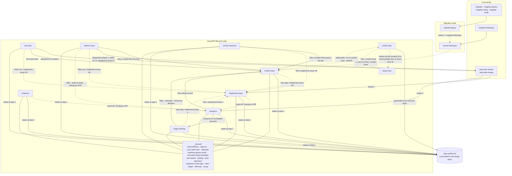
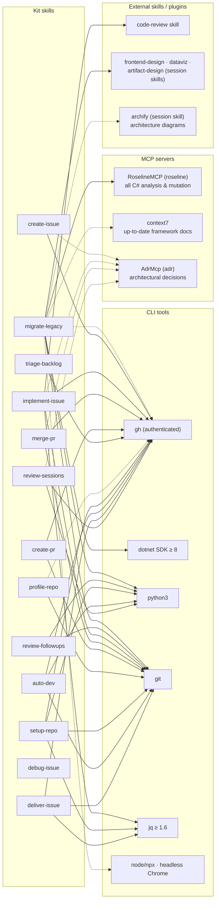

# Architecture

One plugin, two cooperating suites — the **migration pipeline** (migrate-legacy, review-followups)
and the **issue/PR lifecycle** (create-issue, implement-issue, merge-pr, profile-repo, setup-repo,
and the `auto-dev` fleet supervisor above them) — bridged where a migration's deferred work becomes
tracked GitHub issues. Every skill carries `metadata.suite: tagout` in its frontmatter; in
Claude Code the plugin namespaces them as `tagout:<skill>`. The graphs below are the map;
the narrative that reads them in order — the two loops, when to call which skill, the machinery, where
each MCP server is used — is [`docs/methodology.md`](docs/methodology.md).

Every folder under `skills/` is named by one of two rules, so the inventory below is predictable
rather than arbitrary: a **standalone** skill is `verb-object`, and a **member of a family** is
`<family>-<role>`, where the family is itself a rule-1 name or the bare verb that heads it. Renames
happen only in a major —
[ADR 0012](docs/adr/0012-two-skill-naming-rules-verb-object-and-family-role.md) is the decision.

## Skill call graph — who calls whom

Solid arrows = one skill **invokes** another during its own run — nobody types a command. Dashed
arrows are **hand-offs**: the command the user runs next when this skill finishes.
The cylinder is shared **data**, not a skill: the committed per-repo profile.

**The dashed edges above are checked, not hand-synced.** They must match the hand-off table in
[`skills/_shared/recap.md`](skills/_shared/recap.md) exactly — one row per skill, and one edge per
`/command` a row names (`profile-repo` names two, so it draws two) — and `scripts/recap-wiring-check.py` refuses in CI when either side gains or loses
one (#175). Edit the table; the graph follows. Labels are free text: only the `(from, to)` pair is
compared.

The `review-followups → create-issue → implement-issue → merge-pr → create-issue` chain is
deliberate: `merge-pr` files the follow-ups it discovers, which feeds the queue again — the backlog
stays truthful instead of evaporating in chat.

**That chain is a cycle, and `triage-backlog` is what keeps it from being a closed one.** Three
inlets write to the queue — `merge-pr` Step 6, `auto-dev`'s off-scope capture, and direct
`create-issue` runs — while for a long time the only way out was to build the thing, so the queue
could only drain at the speed of implementation, which is also what fills it. `triage-backlog` is the
outlet: it re-decides what is already there, and closing by decision is a documented state there just
as it has always been in `review-followups`. The two inlets and the outlet share one criterion —
[`skills/_shared/filing-bar.md`](skills/_shared/filing-bar.md) — so what earns an issue and what
earns continued residence are the same question, asked at different times.

## External dependencies — MCP servers, plugins, tools

Solid = required (the skill stops or degrades hard without it). Dashed = recommended
(documented degradation). Canonical machine-readable source: [`requirements.json`](requirements.json),
verified by `scripts/preflight.sh` at phase 0; entries hard-required by a specific skill carry a
`requiredBy` list, cross-checked in CI against that skill's `compatibility` frontmatter by
`tests/skills/check-frontmatter.py` — so the manifest and the distributed metadata cannot drift
apart silently.

`debug-issue` (DI) has no external dependency at all — it is a pure process skill, which is
why no arrow leaves it.

## Dependency matrix

| Skill | MCP | External skills | CLI tools | Kit scripts |
|---|---|---|---|---|
| `migrate-legacy` | **roseline** (required) · context7 (rec.) | frontend-design, dataviz, artifact-design (session) | **dotnet ≥ 8**, **git**, **python3** · gh, node, Chrome (rec.) | `preflight.sh`, `audit-inventory.sh`, `report-dashboard.py`, `contrast-check.py` |
| `review-followups` | — | — | **python3**, **git** | `followups.py`, `report-dashboard.py` |
| `create-issue` | adr (rec.) | — (brainstorm, spec and plan doctrine in `skills/_shared/brainstorm-and-spec.md`, `plan-shape.md`) | **gh** | — |
| `implement-issue` | adr (rec.) | code-review (plan shape and TDD loop in `skills/_shared/plan-shape.md`, `tdd-loop.md`; worktrees via its own `make-worktree.sh`) | **gh**, **git**, **jq** (`tick-plan.sh`'s round-trip check) | — |
| `create-pr` | — | — (the PR-open recipe in `skills/_shared/open-pr.md`) | **gh** (push rights), **git** | `guarded-push.sh` (borrowed from implement-issue) |
| `merge-pr` | adr (rec.) | — | **gh** (merge rights), **git** | — |
| `auto-dev` | — | drives create-issue, implement-issue, merge-pr · `loop` (heartbeat) | **gh** (merge rights), **git** · python3 (cost reports) | `survey.sh`, `reconcile.sh`, `wait-ci.sh`, `usage_report.py`, `analyze_cache.py`, `measure_phase2.py` (bundled in the skill) |
| `deliver-issue` | — | dispatches create-issue, then the two `auto-dev` worker commands (implement-issue → merge-pr) in fresh sub-agents | **gh** (merge rights), **git**, **jq** (`wait-ci.sh` reads gh's check table with it) | `skills/auto-dev/scripts/wait-ci.sh` (borrowed; ships nothing of its own) |
| `triage-backlog` | — | — | **gh** (issue write) | — |
| `review-sessions` | adr (rec., the prior-rejection lookup) | files through create-issue | **python3** (`harvest.py`, stdlib) · **gh** (via create-issue) | `harvest.py` (bundled in the skill) |
| `debug-issue` | — | — | — | `find-polluter.sh`, `scripts/hitl-loop.template.sh` (bundled in the skill) |
| `profile-repo` | — | — | **git**, bash · gh (degraded TODOs without) | `repo-profile.sh` (bundled in the skill) |
| `setup-repo` | — | — | **git**, **python3** (PyYAML), **jq**, **gh** (admin rights on the settings, topics and Pages surfaces; each refused by name without it) | `repo-setup.sh`, `parse-manifest.py`, `project-area-options.py` (bundled in the skill) |

**Bold = required.** The lifecycle trio — and `auto-dev` above them — additionally *reads*
`.claude/skills/repo-profile.md` in the target repo — generated once by `profile-repo`,
committed, then consumed with a plain `cat`.

**The dashed `adr` arrows are the degrading ones.** `create-issue` consults the accepted ADRs before
it brainstorms and `implement-issue`/`merge-pr` propose an ADR update when a diff touches a path an
ADR's `code_refs` names; with AdrMcp absent all three fall back to grepping `docs/adr/*.md`
frontmatter and say so. The repo profile's *ADRs* section is where each of them reads the root from.

The **rejected** ADRs are the second traffic on those arrows, and they degrade asymmetrically
(`skills/_shared/prior-rejections.md`). `create-issue` Step 3, `merge-pr` 6c and `triage-backlog`
Step 4 *read* them — semantic `search_adrs` with the server, `skills/triage-backlog/scripts/rejected-adrs.sh`
without it, and the recap says which ran. `triage-backlog` Step 7 is the only *writer*, and without
the server it **refuses to author** rather than degrading: a degraded read still catches the obvious
repeats and announces that it was degraded, while a degraded write would produce a rejection nobody
can search.

## Where each concern lives

| Concern | Single source |
|---|---|
| Prerequisites (runtime check) | `requirements.json` (levels + per-skill `requiredBy`) → `scripts/preflight.sh` (phase 0) |
| Prerequisites (distribution) | each SKILL.md's `compatibility` frontmatter |
| Repo-specific facts for the lifecycle trio | `.claude/skills/repo-profile.md` (per target repo) |
| Migration state & follow-up queue | `migration/report.json` per migrated repo (never a parallel list) |
| Triggering contracts | `evals/<name>-trigger-eval.json` — one per skill; structure guarded by `tests/skills/check-frontmatter.py` in CI, trigger rate measured on demand by `evals/run_all.py` |
| Domain language | `CONTEXT.md` (repo root; the same convention `create-issue` / `implement-issue` read in a target repo) |
| Agent-facing conventions for working on the kit itself | [`.claude/CLAUDE.md`](.claude/CLAUDE.md) — pointers only, loaded as project memory (#325) |
| Version | `plugins/tagout/.claude-plugin/plugin.json` (and its `tagout-migrate` twin), bumped by release-please — **never** a `metadata.version` in a SKILL.md |

## Caller-supplied path diagnostics

A diagnostic about a caller-supplied relative path prints the **resolved** path, and **names the
base it was resolved against** — an absolute path was resolved against nothing, so it gets no such
clause. The wording shares one template, `(chemin relatif résolu depuis <base>)`, verbatim across
all three readers; `report-dashboard.py`'s `resolution_hint()` appends its own extra clause (`, le
répertoire du report.json`) because its base needs that extra word — the other two resolve against
the plain cwd and need no such qualifier.

Three readers implement this today; a fourth is visibly a fourth:
- `scripts/report-dashboard.py` (`resolution_hint()`, paths inside a `report.json`) — #102
- `scripts/followups.py` (`load_repo`, a repo directory relative to the cwd) — #143
- `scripts/audit-inventory.sh` (the `<repo-dir>` argument) — #143

Why: #49 was `"coverage"` in `migration/report.json` meaning `migration/coverage` — a path nobody
typed — and `introuvable : …/migration/coverage` gave no purchase on why it meant that. #102 closed
the gap for one reader; #143 closed it for the other two.

## Versioning

The plugin ships as one unit with no per-skill version granularity. See [ADR 0003](docs/adr/0003-one-plugin-version-no-per-skill-version.md) for the decision and its enforcement via `check-frontmatter.py`.
