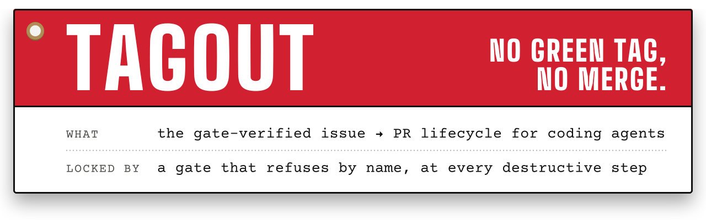

# Tagout

**The gate-verified issue → pull request lifecycle for coding agents: no green tag, no merge.** An
idea becomes a planned issue, the issue becomes a pull request, the pull request lands — and every
destructive step runs behind a gate that refuses by name, saying who locked it and what clears it.
Add `tagout-migrate` when the thing to upgrade is a legacy .NET application.

Two plugins, one marketplace — install the first everywhere, the second only for .NET:

| Plugin | What it contains | Who installs it | Install (Claude Code) |
|---|---|---|---|
| **`tagout`** | The issue → PR lifecycle: `create-issue`, `implement-issue`, `create-pr`, `merge-pr`, `deliver-issue`, `auto-dev`, `triage-backlog`, `debug-issue` and their siblings, with the git write-gate and the auto-dev Stop gate. No .NET, no MCP server. | Anyone with a GitHub repository, in any language. | `claude plugin install tagout@tagout-marketplace` |
| **`tagout-migrate`** | The .NET migration add-on: the seven-phase `/migrate` pipeline (`/migrate-assess`, `/migrate-audit`, `/migrate-verify`, `/migrate-followups`), the roseline `Read` gate, and the RoselineMCP and AdrMcp servers. | A team upgrading a legacy .NET application. Needs the .NET 10 SDK — RoselineMCP starts with `dnx`. | `claude plugin install tagout-migrate@tagout-marketplace` |

Add the marketplace once first — `claude plugin marketplace add phmatray/tagout`. Every other host
is under [Install](#install).

<!-- portfolio-badges:start -->
<!-- Identity -->
[](https://github.com/phmatray/tagout)

[](https://github.com/phmatray/tagout/stargazers)
[](https://github.com/phmatray/tagout/network/members)
[](https://github.com/phmatray/tagout/blob/HEAD/LICENSE)

<!-- Activity -->
[](https://github.com/phmatray/tagout/issues)
[](https://github.com/phmatray/tagout/pulls)
[](https://github.com/phmatray/tagout/commits)
<!-- portfolio-badges:end -->

<!-- portfolio-toc:start -->

## Table of Contents

- [Why this kit exists](#why-this-kit-exists)
- [Which command?](#which-command)
- [Proven in production](#proven-in-production)
- [Prerequisites](#prerequisites)
- [Install](#install)
- [Quickstart](#quickstart)
- [The audit product — `/migrate-audit`](#the-audit-product--migrate-audit)
- [The pipeline](#the-pipeline)
- [Commands](#commands)
- [Skills](#skills)
- [Desktop launcher](#desktop-launcher)
- [Safety rails](#safety-rails)
- [Repository layout](#repository-layout)
- [Proof it works](#proof-it-works)
- [Tech Stack](#tech-stack)
- [Contributing](#contributing)

<!-- portfolio-toc:end -->


## Why this kit exists

Five failure modes this kit was built to close, each with the evidence behind it:

| Problem | Fix | Evidence |
|---|---|---|
| *"Upgrading" meant bumping the TFM and hoping.* | Seven gated phases, resume at the last green gate — [`skills/migrate-legacy/SKILL.md`](skills/migrate-legacy/SKILL.md) | The case-study table in [Proven in production](#proven-in-production): 18 min / ~30 min / ~1 h, measured. |
| *The agent reads whole C# files instead of asking Roslyn.* | The roseline gate denies `Read` on `.cs` and names the tool that replaces it — [`hooks/roseline-gate.sh`](hooks/roseline-gate.sh), [docs/roseline-gate.md](docs/roseline-gate.md) | Preflight only ever proved roseline was *connected*, never that it was *used* (#109). |
| *Four agents, one checkout — a commit lands in another agent's PR, and every command exits 0.* | Guarded git writes that assert the branch before and after — [`skills/implement-issue/SKILL.md`](skills/implement-issue/SKILL.md) — and the git write-gate that denies the raw command at the tool call, [`hooks/git-write-gate.sh`](hooks/git-write-gate.sh) | #26 / #280: a `git commit` in the wrong checkout, silently accepted. |
| *The fix ships before the cause is known.* | Root cause first, then the patch — [`skills/debug-issue/SKILL.md`](skills/debug-issue/SKILL.md) | Guessing at a fix treats a symptom; the cause resurfaces elsewhere. |
| *Three inlets, no outlet — the backlog only ever fills.* | One filing bar for every inlet, and a skill that re-decides what's already there — [`skills/triage-backlog/SKILL.md`](skills/triage-backlog/SKILL.md), [`skills/_shared/filing-bar.md`](skills/_shared/filing-bar.md) | [ARCHITECTURE.md](ARCHITECTURE.md)'s cycle paragraph: three writers, nothing that ever closed the loop. |

Framing ported from mattpocock/skills' README ("Why These Skills Exist", problem → fix → linked
skill — MIT), adapted to this kit's own history rather than a quote.

## Which command?

A situational way in, folded from a router-skill proposal declined in the v2 meta review
(ARCHITECTURE.md's call graph is already the map — see [ARCHITECTURE.md](ARCHITECTURE.md)):

| Situation | Reach for |
|---|---|
| New here — how the whole thing fits together | [`docs/methodology.md`](docs/methodology.md) — the two loops, when to call which skill, where each MCP server is used |
| An idea to track | [`create-issue`](skills/create-issue/SKILL.md) |
| An issue with a plan | [`implement-issue`](skills/implement-issue/SKILL.md) `#N` |
| A finished branch to open as a PR | [`create-pr`](skills/create-pr/SKILL.md) (`#N`, `--draft`) |
| A PR to land | [`merge-pr`](skills/merge-pr/SKILL.md) `#N` |
| One idea or issue to a merged PR, hands-off | [`deliver-issue`](skills/deliver-issue/SKILL.md) `<idea>` or `#N` |
| A queue that never shrinks | [`triage-backlog`](skills/triage-backlog/SKILL.md) |
| What went wrong in my last sessions | [`review-sessions`](skills/review-sessions/SKILL.md) (`--dry-run` lists) |
| Many issues, hands-off | [`auto-dev`](skills/auto-dev/SKILL.md) |
| A legacy .NET app | [`/migrate-assess`](commands/migrate-assess.md), then [`/migrate`](commands/migrate.md) |
| A migrated app to re-verify | [`/migrate-verify`](commands/migrate-verify.md) |
| A portfolio to cost | [`/migrate-audit`](commands/migrate-audit.md) |
| Open follow-ups across migrated repos | [`/migrate-followups`](commands/migrate-followups.md) |
| A new repo for these skills | [`profile-repo`](skills/profile-repo/SKILL.md), then [`setup-repo`](skills/setup-repo/SKILL.md) |
| Something is already broken | [`debug-issue`](skills/debug-issue/SKILL.md) fires on its own |

## Features

- **Issue/PR lifecycle skills** — portable `create-issue`, `implement-issue`, `merge-pr` and `profile-repo` skills usable on any repo, driven by a committed per-repo profile.
- **Backlog burn-down at scale** — `auto-dev` supervises a fleet of N parallel workers, each taking one issue from plan to merged PR, with conflict-avoiding area isolation and a measured token budget.
- **Root-cause debugging** — `debug-issue` fires before any fix is proposed, so a failure is explained before it is patched.

The .NET migration add-on, `tagout-migrate`:

- **Seven-phase gated pipeline** — Assess → Baseline → Retarget → Remediate → Modernize → Verify → Deliver, each phase ending at a build/test/diagnostics gate before the next one starts.
- **RoselineMCP-powered C# analysis** — Roslyn-backed solution diagnostics, bulk code fixes, surgical member edits, safe renames and reference/call-graph impact analysis drive every transformation step.
- **Read-only executive audit** — `/migrate-audit` produces a costed report (effort in days, risk register, recommended target) per app, plus a portfolio value/effort synthesis across several apps.
- **Resumable migrations** — gate commits and `migration/` artifacts let an interrupted `/migrate` re-enter at the last green phase instead of starting over.
- **Generated executive dashboard** — phase 6 emits `migration/report.html` and `report.json` with measured per-phase timings derived from gate commits, not a manual stopwatch.
- **Preflight safety gate** — `scripts/preflight.sh` verifies required/recommended tools, MCP servers and session skills declared in `requirements.json` before phase 1 starts.
- **CI/deployment templates** — `templates/ci-dotnet.yml` and `templates/deploy-pages-blazor.yml` wire a migrated app straight into GitHub Actions and Pages. A repo that commits its front-end bundle can also arm the drift gate — see [docs/bundle-gate.md](docs/bundle-gate.md).

## Proven in production

Four dead-platform apps (WinRT 8.x, Windows Phone, UWP) audited, migrated to Blazor WebAssembly
and **verified live** with this kit — characterization tests first, legacy data and art byte-for-byte,
measured WCAG AA, offline proven with the network cut, and a permanent post-deploy smoke test:

| App (2013–2016) | Live | Audit estimate | Measured pipeline time |
|---|---|---|---|
| Sokoban (WinRT 8.1) | [phmatray.github.io/sokoban](https://phmatray.github.io/sokoban/) | 13 j | vague 1 |
| Chords (Windows Phone) | [phmatray.github.io/chords](https://phmatray.github.io/chords/) | 13 j | **18 min** |
| Les Fleurs du Mal (WinRT 8.1) | [phmatray.github.io/fleurs-du-mal](https://phmatray.github.io/fleurs-du-mal/) | 18 j | **~30 min** |
| Pokédex G (UWP + SQLite 49 MB) | [phmatray.github.io/pokedex](https://phmatray.github.io/pokedex/) | 29 j | **~1 h** |

Full portfolio audit, per-app reports and the lessons each wave fed back into the kit:
[docs/case-studies/winrt-portfolio/](docs/case-studies/winrt-portfolio/) and [CHANGELOG.md](CHANGELOG.md).

## Prerequisites

The canonical list — required and recommended tools, MCP servers and session skills — lives in
[`requirements.json`](requirements.json), the single source that `scripts/preflight.sh` (phase 0)
reads and verifies. In short: [Claude Code](https://code.claude.com) with **RoselineMCP** connected
(`claude mcp list` should show `roseline`), a .NET SDK (latest LTS recommended), git, python3 — and
the target application in a git repository.

### RoselineMCP is shipped *and* enforced

The kit ships RoselineMCP itself ([`.mcp.json`](.mcp.json), `dnx RoselineMCP --yes` — needs the
**.NET 10 SDK**; the pipeline itself only needs `dotnet >= 8`, so an 8/9-only host degrades loudly
rather than silently) and **enforces** its use:
[`hooks/roseline-gate.sh`](hooks/roseline-gate.sh) denies `Read` on a C# file, naming the roseline
tool that replaces it. Four properties keep that safe:

- **Inert outside C# projects** — no-ops when no `*.sln`/`*.slnx`/`*.csproj` is found upward.
- **A one-shot escape** — the identical `Read` again is let through once — consumed, not latched (a third read denies again), and it expires.
- **Fails open, always** — no `jq`, an unparseable payload, any internal error, and the `Read`
  proceeds; it never fails closed.
- **It never enforces a tool that cannot be there** — no `dnx` on `PATH` means the deny message
  would point at tools that don't exist, so the gate lets the `Read` through instead.

Full reference — the `dnx` version floor, the `Edit` escape hatch for what roseline can't reach
(`using` directives, file-scoped namespaces, attributes, top-level statements), both env switches
(`ROSELINE_GATE=on|off`), and the permissions caveat — lives in
[docs/roseline-gate.md](docs/roseline-gate.md).

### Destructive git writes are gated the same way

[`hooks/git-write-gate.sh`](hooks/git-write-gate.sh) is the second shipped `PreToolUse` hook, on
`Bash` rather than `Read`, and it is built on the same three properties:

- **What it denies** — whole-tree discards (`git checkout .`, `git restore .`), `git reset --hard`,
  `git clean -f…`, a forced `git push`, a **bare** `git commit`/`push`/`merge`, and a **bare** `gh pr merge`.
  Git denials name the matching `guarded-*.sh` under `skills/implement-issue/scripts/` (which asserts
  the branch before and after; #26, #280), and `gh pr merge` denials name
  `skills/merge-pr/scripts/guarded-pr-merge.sh`. Calling one of the three **git** guards is allowed —
  `--force-with-lease` and other options to the guard itself included — but, like `guarded-pr-merge.sh`,
  it exempts only its own segment, never the rest of the line (#533): the "look for the guard, else
  merge/commit/push raw" shape names the guard too, and the raw write beside it is still judged.
- **Inert unless the guards exist** — it only ever denies in a repository that carries a
  `.claude/skills/repo-profile.md`, i.e. one that has opted into the lifecycle skills. Everywhere
  else the plugin is installed, it says nothing.
- **Fails open, always** — no `jq`, no `awk`, no `git`, an unparseable payload, quoting it cannot
  trust, and the command proceeds. `GIT_GATE=off` (also `0|false|no|disabled`) disables it outright
  — as a prefix on the one command (`GIT_GATE=off git …` or `GIT_GATE=off gh …`), or set where
  Claude is launched for the whole session; an `export` typed into a Bash call never reaches the
  hook (#372). The prefix is not offered to, or honoured for, a sub-agent (its payload carries
  `agent_id`), which has nobody to approve it. `GIT_GATE=on` forces it past the profile probe, and
  `off` still wins.
- **The probe follows `cd`** — `cd /tmp/shop && git init && git commit` is that repository's commit,
  not the cwd's, so a literal, resolvable `cd` moves the profile lookup the way `-C <path>` does;
  a `git init` marks what follows as a brand-new, guard-less repository (#372). And the arms read
  **meaning, not spelling** (#373): `./`, `:/`, a bundled `-fq`, a `-note` file name after `--`
  are judged as what git does with them, while `restore --staged .` and `push --dry-run` — read-only
  or less destructive than the replacement a denial would name — pass.

It tokenises rather than greps, so `echo "git push --force"` and `git log # git reset --hard` are
not denied. Prior art: `git-guardrails-claude-code/scripts/block-dangerous-git.sh` in
[mattpocock/skills](https://github.com/mattpocock/skills) (MIT) — the idea, deliberately not the
script; [`hooks/git-write-gate.sh`](hooks/git-write-gate.sh)'s header records the four reasons.

### The kit's skill-routing table travels via a SessionStart hook

[`hooks/routing-context.sh`](hooks/routing-context.sh) is the third shipped hook, on `SessionStart`
rather than `PreToolUse`: it extracts [`AGENTS.md`](AGENTS.md)'s *Which kit skill, for what*
section and injects it as `additionalContext`, so the routing table reaches a session even when the
working directory is not this repository (#416). `AGENTS.md` is the table's one home (#525) — the
file every other host reads as well — and there is no second copy: a heading rename or removal there
empties the extraction rather than reading stale.

- **Fails open, always** — no `jq`, no `CLAUDE_PLUGIN_ROOT`, an unreadable `AGENTS.md`, or an
  empty extraction, and the hook prints nothing and exits 0; it never blocks anything (it has no deny
  path to begin with).
- **`ROUTING_CONTEXT=off`** (also `0|false|no|disabled`) disables it outright — set where Claude is
  launched, the same as `GIT_GATE`/`ROSELINE_GATE`. There is no `=on` counterpart: unlike the two
  gates above, there is no probe here for a declaration to override.

### auto-dev's never-wait invariant is a runtime Stop gate, not a prompt lint

[`hooks/autodev-stop-gate.sh`](hooks/autodev-stop-gate.sh) is the fourth shipped hook, on `Stop`
rather than `PreToolUse`/`SessionStart` — the kit's first hook that can block a **user** action
(ending the session) rather than a model one, which is why its evidence has to be narrow:

- **What it refuses** — a stop, but only when `auto-dev`'s own pinned state file
  ([`skills/auto-dev/SKILL.md`](skills/auto-dev/SKILL.md) Step 2) exists for *this* repository, is
  recent, and its `## In flight` or `## Queue` sections name undrained work. Exit 2 with a message on
  stderr naming the in-flight slot(s), the queue depth, and the off-switch; the harness feeds that
  back and retries, and `stop_hook_active: true` on the retry is what stops the refusal looping.
- **Inert everywhere else** — no state file for this repo, an empty or stale one, a payload the hook
  can't parse, no `jq`/`git`/`awk`/`find` on `PATH`: every one of those exits 0 with no output. There
  is no probe to force past (unlike the other two gates) — the state file itself is the only
  evidence, and there is nothing else to declare.
- **`AUTODEV_GATE=off`** (also `0|false|no|disabled`) disables it outright, checked first so a stale
  override can never fight a value just typed — set where Claude is launched, the same as
  `GIT_GATE`/`ROSELINE_GATE`. There is no `=on` counterpart, for the same reason `ROUTING_CONTEXT` has
  none.

Built to replace `tests/auto-dev-never-wait/test.sh`'s prompt-wording grep with something that
observes an actual run instead — that suite stays (the prompt clause is still worth having), and this
hook is the mechanism behind it (#417).

### AdrMcp is shipped too — recommended, not enforced

The kit's own architectural decisions live under [`docs/adr/`](docs/adr/README.md) as MADR 4.0
markdown, and [AdrMcp](https://github.com/Atypical-Consulting/AdrMcp) is what makes them *askable*
rather than merely present: `search_adrs` at brainstorm time, `find_stale_adrs` when a `code_refs`
entry stops resolving, `suggest_adr_from_change` when a diff touches a path a decision governs. It
ships the same way roseline does — [`.mcp.json`](.mcp.json) (`dnx AdrMcp --yes`), so installing the
plugin installs the dependency — and needs the same **.NET 10 SDK** for `dnx`.

The difference is the level. [`requirements.json`](requirements.json) records it as
**`recommended`**, not required: roseline is required because *every* C# analysis goes through it,
while ADRs are consulted at one step each of three skills — `create-issue` before it brainstorms,
`implement-issue` and `merge-pr` when a diff touches a path a decision governs. Without the server
all three fall back to grepping `docs/adr/*.md` frontmatter and **say so in their recap**, so the
degradation is named rather than silent. CI cannot start an MCP server, so
`python3 tests/adr/check-adrs.py` is a deliberate structural mirror of the server's own
`validate_adr`, and it gates the committed ADRs on every run.

### Archify is recommended too — but you install it, not the plugin

A migration decision is a decision about *shape*: which projects depend on which, where the
Windows-only surface sits, what the target topology becomes. The pipeline's most consequential
deliverables — phase 1's assessment, `/migrate-audit`'s per-app report, `migration/report.html` —
costed that shape in days and never drew it.
[Archify](https://tt-a1i.github.io/archify/) ([tt-a1i/archify](https://github.com/tt-a1i/archify),
MIT) draws it: a validator and a deterministic renderer that turn a JSON spec plus a mermaid
flowchart into a self-contained, explorable `migration/architecture.html`, plus a dual-theme SVG the
dashboard embeds.

The difference from roseline and AdrMcp is **how it arrives**. Those two are MCP servers shipped in
[`.mcp.json`](.mcp.json), so installing the plugin installs them. Archify is an agent *skill*: it
lands in your own skill list and **does not arrive with the plugin**. Install it yourself:

```bash
npx skills add tt-a1i/archify -g
```

[`requirements.json`](requirements.json) records it as a **`recommended`** session skill, and that
level is a promise about its absence. A session capability cannot be checked from bash — the agent
confirms it against its own skill list, and `scripts/preflight.sh` reports it `unknown` — so a
`required` line here would be documentation pretending to be a gate, and a phase-0 hard fail over a
diagram would stop every migration on a host without Node. Without Archify the phases draw the
**mermaid** fence they already built as the spec's own companion and say so in their recap: never a
hard stop, never a silent omission.

## Install

The kit is written for Claude Code and installs as a plugin on five more hosts from this same
repository; a dozen others load it through a rule file. Which host gets what, and the file that
adapts it, is one table: [`docs/_data/hosts.yml`](docs/_data/hosts.yml) — the decision behind it is
[ADR 0014](docs/adr/0014-the-kit-is-claude-code-first-and-reaches-other-hosts-through-thin-adapters.md).
Only Claude Code installs the two plugins separately; on every other host the manifest ships the
lifecycle and the .NET migration add-on together.

### Claude Code

The lifecycle — every repository, any language:

```bash
claude plugin marketplace add phmatray/tagout
claude plugin install tagout@tagout-marketplace
```

The .NET migration add-on — only to upgrade a legacy .NET application; it brings the RoselineMCP and
AdrMcp servers and needs the .NET 10 SDK:

```bash
claude plugin install tagout-migrate@tagout-marketplace
```

Inside a session the same commands work as `/plugin marketplace add` and `/plugin install`.

### Codex

```bash
codex plugin marketplace add phmatray/tagout
```

Then open `/plugins`, install Tagout, and review and trust its hooks in `/hooks`.

### GitHub Copilot CLI

```bash
copilot plugin marketplace add phmatray/tagout
copilot plugin install tagout@tagout-marketplace
```

### Gemini CLI

```bash
gemini extensions install https://github.com/phmatray/tagout
```

### Antigravity CLI

```bash
agy plugin install https://github.com/phmatray/tagout
```

### pi

```bash
pi install git:github.com/phmatray/tagout
```

The issue → pull request skills work there as they are; the migration pipeline needs RoselineMCP,
which pi does not load from a package.

### Cursor, Windsurf, Cline, Kiro, GitHub Copilot, and every `AGENTS.md` host

Clone the kit once, then copy the rule file your host reads into your project — it routes each
request to a skill in the clone:

```bash
git clone https://github.com/phmatray/tagout ~/.tagout
mkdir -p .cursor/rules && cp ~/.tagout/.cursor/rules/tagout.mdc .cursor/rules/
```

That second line is Cursor's; the host table has every host's. For the migration pipeline, register
RoselineMCP and AdrMcp — `dnx RoselineMCP --yes` and `dnx AdrMcp --yes`, .NET 10 SDK — in the host's
MCP settings.

## Quickstart

```text
cd your-legacy-app
claude
> /migrate-assess          # read-only audit → migration/assessment.md
> /migrate                 # full pipeline (phases 1–7, through verified production)
> /migrate-verify          # re-runnable final quality gate
```

## The audit product — `/migrate-audit`

The kit's front door: a **read-only executive audit** that speaks to decision-makers, not just developers. For each target app it delivers a costed report — technology era, UI surface, platform-API mapping, share of business logic that ports as-is, effort estimate in days (transparent formula, ±30%), recommended target (Blazor WASM/Server/Hybrid), risk register and cost of inaction. Point it at several apps and it adds a **portfolio synthesis**: value/effort matrix, migration order, first wave. Every number comes from `scripts/audit-inventory.sh` (reproducible JSON), and it also covers dead-platform apps (WinRT, UWP, Windows Phone → Blazor) where the question is UI rewrite + logic porting, not a TFM bump. See the real case study: [docs/case-studies/winrt-portfolio/](docs/case-studies/winrt-portfolio/).

## The pipeline

| # | Phase | Purpose | Key RoselineMCP tools | Exit gate |
|---|-------|---------|----------------------|-----------|
| 1 | **Assess** | Read-only inventory: TFMs, packages, diagnostics, risk map | `analyze_solution`, `search_symbols` | `migration/assessment.md` written, zero files touched |
| 2 | **Baseline** | Build + tests green; characterization tests where coverage is missing | `get_call_graph`, `analyze_solution` | Green build + tests, baseline recorded |
| 3 | **Retarget** | Bump TFMs and packages in dependency order | `get_symbol_at_position`, `find_references` | Solution builds on the new TFM |
| 4 | **Remediate** | Drive diagnostics to zero errors; bulk-fix mechanical issues | `list_diagnostics`, `apply_fixes`, `edit_member` | 0 errors, warnings ≤ baseline, tests green |
| 5 | **Modernize** | Opt-in idiom upgrades (nullable, async, file-scoped namespaces) | `find_references`, `rename_symbol`, `edit_member` | Build + tests green after each item |
| 6 | **Verify** | Final gate + generated executive dashboard | `analyze_solution` | `migration/report.html` (generated) + `report.md`, all green |
| 7 | **Deliver** | CI + deployment from kit templates, production verified | — | public URL answers on deep routes, screenshot reviewed |

A **phase 0 preflight** (`scripts/preflight.sh`, `--json` for machine output) gates the whole pipeline. It reads the prerequisite manifest [`requirements.json`](requirements.json) — the single source for required/recommended tools, MCP servers and session skills: required items hard-fail; recommended capabilities degrade **loudly** — every absence is recorded in the report with the fallback used, and entries a specific skill hard-requires carry a `requiredBy` list that skill enforces at its own preconditions step. Session-level skills (the manifest's `sessionSkills`) are confirmed by the agent itself at phase 0.

Two properties fall out of the gate discipline. **Resume**: re-running `/migrate` on an interrupted migration never starts over — the gate commits and `migration/` artifacts locate the last green gate, and the pipeline re-enters at the phase after it. **Measured time**: the per-phase timeline in `migration/report.json` (`phases[]`, rendered by the report dashboard) is derived from the gate commits — the minutes this README advertises are a generated fact, not a stopwatch.

## Commands

User-typed entry points, each a `commands/*.md` file:

| Command | Job |
|---|---|
| [`/migrate`](commands/migrate.md) | The full seven-phase pipeline, phase 1 through verified production. |
| [`/migrate-assess`](commands/migrate-assess.md) | Read-only phase-1 audit only — `migration/assessment.md`, zero files touched. |
| [`/migrate-verify`](commands/migrate-verify.md) | Re-runnable final quality gate for an already-migrated app. |
| [`/migrate-audit`](commands/migrate-audit.md) | The read-only executive audit product — costed report, one app or a portfolio. |
| [`/migrate-followups`](commands/migrate-followups.md) | Consolidate the open follow-up queue across migrated repos. |
| [`/auto-dev-worker`](commands/auto-dev-worker.md) | Dispatched by `auto-dev` per issue — phase 1 of the two-phase worker (implement up to a ready PR). |
| [`/auto-dev-merge`](commands/auto-dev-merge.md) | Dispatched by `auto-dev` per PR — phase 2 (land it, in a fresh context). |

## Skills

Model-invoked, each a `skills/<name>/SKILL.md` file. The issue/PR lifecycle trio and their
supervisors are usable on any repo, not just migrations.

**The names follow two rules, so the list below is predictable rather than arbitrary:** a standalone
skill is `verb-object` (`create-issue`, `profile-repo`, `debug-issue`), and a member of a family is
`<family>-<role>`, where the family is itself a rule-1 name or the bare verb that heads it
(`migrate` → `migrate-legacy`, `migrate-assess`, `migrate-followups`; `auto-dev` →
`auto-dev-worker`, `auto-dev-merge`). Renames happen only in a major —
[ADR 0012](docs/adr/0012-two-skill-naming-rules-verb-object-and-family-role.md) is the decision.

| Skill | Job |
|---|---|
| [`migrate-legacy`](skills/migrate-legacy/SKILL.md) | The seven-phase pipeline orchestrator that `/migrate` drives — phase references and playbooks. |
| [`create-issue`](skills/create-issue/SKILL.md) | File a template-compliant issue whose body carries a brainstorm → spec → implementation-plan trail with tickable task checkboxes. |
| [`implement-issue`](skills/implement-issue/SKILL.md) | Execute an issue's plan: worktree, draft PR, one commit per task with live checkbox ticking, review on three axes (standards, spec, verification gap) by read-only sub-agents over a staged diff file, sync with `main`, ready-flip. |
| [`create-pr`](skills/create-pr/SKILL.md) | Open a PR for a finished feature branch: guarded push, ready when the *Full test* is green (draft when asked or red), then the shared PR-open recipe in `skills/_shared/open-pr.md`. |
| [`merge-pr`](skills/merge-pr/SKILL.md) | Land a ready PR: wait for CI, clear blockers (red checks, conflicts, review) in a corrections loop, squash-merge, triage follow-ups (cluster by root cause, fold into the issue that owns them, file at most 3), tear down. |
| [`auto-dev`](skills/auto-dev/SKILL.md) | Supervise a FLEET of N parallel workers over the whole backlog: survey and order the open issues, dispatch area-isolated workers (`implement-issue` → `merge-pr`), wait for CI, verify real merge state, refill each slot as a PR lands. |
| [`deliver-issue`](skills/deliver-issue/SKILL.md) | The single-item form of that chain: one idea or one planned issue to a merged PR, hands-off — files or seeds it through `create-issue`, then dispatches the same two worker commands `auto-dev` uses, each in a fresh sub-agent, waiting for CI in between. `--stop-at ready` leaves the merge to you. |
| [`triage-backlog`](skills/triage-backlog/SKILL.md) | Re-decide the issues already open: verify what's been fixed, cluster by root cause, then propose keep / sharpen / fold / rescope / close-by-decision for each — and execute only what the owner confirms. The outlet the three inlets above don't have. |
| [`profile-repo`](skills/profile-repo/SKILL.md) | Generate or read `.claude/skills/repo-profile.md` — the config the skills above consume. Run once per repo, commit the profile. |
| [`setup-repo`](skills/setup-repo/SKILL.md) | The write half of the profile story: bring a repo to the configuration those skills assume — label taxonomy, `.github/ISSUE_TEMPLATE/` forms, repo settings, description, homepage, topics and the GitHub Pages source — from a declarative manifest. `plan` prints the drift and writes nothing; `apply` converges it, idempotently and additively. |
| [`review-followups`](skills/review-followups/SKILL.md) | Consolidate the migrated repos' open follow-ups (owner decisions, tasks, deferrals) and update them at the source. |
| [`debug-issue`](skills/debug-issue/SKILL.md) | Root cause before any fix is proposed — harness-agnostic, fires on its own ahead of a patch. |
| [`review-sessions`](skills/review-sessions/SKILL.md) | Read previous sessions' transcripts, harvest the failures the kit itself caused (tool errors on kit scripts, gate denials, workers that died waiting, guard refusals, red suites), cluster by root cause, drop what `main` already fixed, and file what earns an issue through `create-issue`. |

Every repo-specific fact (commit identity, build/test commands, label taxonomy, merge style,
conflict hot-spots) lives in the committed per-repo profile — the skills themselves stay portable
(`skills/_shared/` holds their common procedures). They are the natural tail of a migration:
phase 7's `review-followups` queue hands items that deserve a real ticket to `create-issue` (the
report keeps the issue URL), then `implement-issue` and `merge-pr` burn them down. Their dependencies
(authenticated `gh`, a code-review skill — no third-party plugin: the brainstorm, plan and TDD
doctrines ship under `skills/_shared/`) are declared in
[`requirements.json`](requirements.json). Call graph and full dependency matrix:
[ARCHITECTURE.md](ARCHITECTURE.md).

## Desktop launcher

[**AI Kit**](https://github.com/Atypical-Consulting/omarchy-aikit) runs these
skills from the [Omarchy](https://omarchy.org/) desktop instead of the command
line: pick a repository, pick a skill, and the session starts in a tmux terminal.
Issues and PRs are chosen from a list rather than typed as numbers, a bar widget
shows the sessions in flight and the PRs a background `auto-dev` fleet has
landed, and a cross-repo work queue answers "what should I work on?" — failing
CI, requested reviews, your open PRs, assigned and planned issues, across every
repository at once.

Menus read a local SQLite mirror of GitHub kept fresh by a systemd timer, so no
menu waits on the network.

```bash
omarchy plugin add https://github.com/Atypical-Consulting/omarchy-aikit.git --enable
```

## Safety rails

- Dedicated `migration/<date>` branch; commit at every green gate.
- All RoselineMCP mutations run **preview-first**; diffs are inspected before `previewOnly: false`.
- A failed gate stops forward progress — fix or roll back, never skip.
- Destructive git is denied at the tool call, not just discouraged in prose —
  [`hooks/git-write-gate.sh`](hooks/git-write-gate.sh) refuses whole-tree discards, `reset --hard`,
  `clean -f`, a forced push and the bare `commit`/`push`/`merge`, naming the `guarded-*.sh`
  replacement in each reason.
- That gate is **inert** in any repository without a `.claude/skills/repo-profile.md`, and
  it **fails open** on every internal error — the decision recorded in
  [ADR 0002](docs/adr/0002-the-roseline-gate-fails-open-always.md).
- A `GIT_GATE=off` prefix lets one command through — not offered to, or honoured for, a sub-agent
  (its payload carries `agent_id`), which has nobody to approve it; launching Claude with
  `GIT_GATE=off` in its environment disables the gate for the session (an `export` inside a Bash
  call never reaches the hook). `GIT_GATE=on` forces it past the profile probe.
- The guards also refuse a write from a worktree that was destroyed mid-run: `make-worktree.sh`
  records each worktree's path in the repo config, and `guarded-commit/push/merge.sh` compare it to
  where they actually stand before touching the branch (#469).
- `merge-pr` judges the base branch **by sha, never by recency**
  ([`base-run-verdict.sh`](skills/merge-pr/scripts/base-run-verdict.sh)): when the check-runs API
  fails it falls back to the workflow runs for that same sha, and three `unverified` verdicts in a
  row are reported as a finding instead of being absorbed (#479).
- Review sub-agents are read-only and isolated (`subagent_type: Explore`, `isolation: "worktree"`);
  they receive a diff *file* and return findings as text, and the caller applies them — pinned by
  `tests/review-angle-isolation/`.

## Repository layout

```
.claude-plugin/          plugin + marketplace manifests
ARCHITECTURE.md          skill call graph + dependency matrix (mermaid)
CONTEXT.md               the kit's own domain glossary, in Matt Pocock's CONTEXT.md format (ported from mattpocock/skills, MIT)
requirements.json        single source for prerequisites (tools, MCPs, session skills) — read by preflight.sh
commands/                /migrate, /migrate-assess, /migrate-verify, /migrate-audit, /migrate-followups, /auto-dev-worker, /auto-dev-merge
skills/migrate-legacy/   the pipeline orchestrator + phase references + playbooks
skills/review-followups/ consolidated follow-up queue across migrated repos, updated at the source
skills/create-issue/     generic issue/PR lifecycle: seeded issue (brainstorm → spec → plan)
skills/implement-issue/  generic issue/PR lifecycle: plan → draft PR → ready
skills/create-pr/        generic issue/PR lifecycle: a finished feature branch → an open PR
skills/merge-pr/         generic issue/PR lifecycle: CI wait, corrections loop, squash-merge, follow-ups
skills/auto-dev/         fleet supervisor above the lifecycle skills: N parallel workers burning down the backlog
skills/deliver-issue/    the single-item form: one idea or issue to a merged PR, each phase dispatched in a fresh sub-agent
skills/triage-backlog/   the queue's outlet: verify, cluster and re-decide open issues — owner confirms every close
skills/debug-issue/      root-cause-before-fix process, harness-agnostic
skills/review-sessions/  the retro across sessions: harvest.py over the transcripts → cluster → verify → filing bar → create-issue
skills/profile-repo/     the per-repo profile generator the lifecycle skills consume
skills/setup-repo/       the write half of that: plan/apply a repo's labels, issue forms, settings, topics and Pages source from a manifest
skills/_shared/          procedures shared by the lifecycle skills (preconditions, open-pr, sync-with-main, filing-bar, worktree-ignore-check, untrusted-input-boundary, test-seams, grilling, brainstorm-and-spec, plan-shape, tdd-loop, recap)
scripts/                 preflight.sh (phase-0 gate) · run-all-tests.sh (one command for everything CI checks, exit 2 on a missing prerequisite) · audit-inventory.sh (JSON inventory) · report-dashboard.py (report generator) · contrast-check.py (WCAG AA gate) · followups.py (open-tail aggregator) · release-title-gate.sh + release-title-diff.sh (a change to shipped content must carry a title that cuts a release) · recap-wiring-check.py (every skill closes with the shared recap, and its hand-off table matches ARCHITECTURE.md's dashed edges)
templates/               ci-dotnet.yml + deploy-pages-blazor.yml — CI/deployment a migration drops into the target repo · repo-setup.yml + issue-forms/ — the desired GitHub configuration setup-repo applies · bundle-gate.json.example — copy-pasteable config for the opt-in committed-bundle drift gate
tests/                   one golden suite per contract, each a tests/<name>/test.sh that CI runs — and a CI step fails the build if a suite is ever left unwired. Run them all with `./scripts/run-all-tests.sh`. tests/skills/ also lints every prompt: frontmatter, shared refs, and every file path a prompt names must resolve (check-file-refs.py)
samples/LegacyShop/      deliberately-legacy .NET solution (demo fixture, CI-guarded)
docs/methodology.md      the user guide: the two loops, when to call which skill, one page per skill, the machinery, MCP usage, how it compares to GSD · SpecKit · BMAD
docs/adr/                the kit's own architectural decisions (MADR 4.0) — index in docs/adr/README.md, served by AdrMcp
docs/case-studies/       real audits and migrations, with generated dashboards
docs/demo-walkthrough.md a real pipeline run, with captured RoselineMCP output
docs/bundle-gate.md      what the opt-in committed-bundle drift gate measures, its validation rules, how to disable it
```

**Hardening a destructive operation.** `tests/tick-plan/` and `tests/guarded-git/` are not feature
tests — each one pins an incident post-mortem (a `gh api` pipeline that wiped live issue bodies; a
commit that landed in another agent's PR), and between them they set the convention this repo
follows: a guard script under `skills/<skill>/scripts/`, a golden test that exercises its **refusal**
path and not just its happy one, and a CI step that runs that test. Adding a call that can destroy
something? Follow that shape rather than calling the raw command.

**Live proof:** [play the wave-1 migrated game](https://phmatray.github.io/sokoban/) — a 2014 WinRT app, dead since Windows 8.x, now a Blazor WASM PWA.

## Proof it works

See [docs/demo-walkthrough.md](docs/demo-walkthrough.md): a genuine run of the pipeline migrating `samples/LegacyShop` from out-of-support **net6.0** to **net10.0**, with real RoselineMCP diagnostics before/after and green tests at the end.

---

<!-- portfolio-techstack:start -->

## Tech Stack

- **.NET 6**
- xunit
- xunit.runner.visualstudio

<!-- portfolio-techstack:end -->

<!-- portfolio-roadmap:start -->

## Roadmap

Planned work and known limitations are tracked in the [open issues](https://github.com/phmatray/tagout/issues). Contributions toward them are welcome.

<!-- portfolio-roadmap:end -->

<!-- portfolio-sections:start -->

## Contributing

Contributions are welcome. Open an issue first to discuss any significant change.

1. Fork the repository and create your branch (`git checkout -b feat/my-feature`)
2. Commit your changes (`git commit -m 'feat: ...'`)
3. Push the branch and open a Pull Request

<!-- portfolio-sections:end -->
