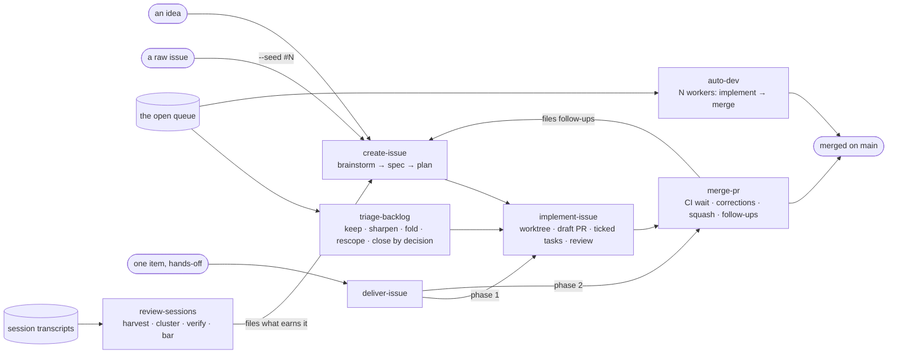
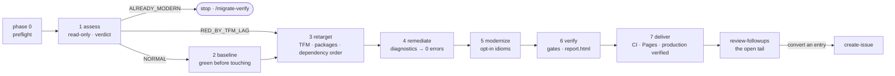

# The methodology — how the kit works, and when to call what

This is the user guide. It reads the kit's pieces in the order a user meets them: the two loops
the kit runs, the table that says which skill answers which request, one page per skill, the
machinery every skill stands on, where each MCP server is actually called, how the whole compares
to the frameworks it is measured against, and two worked examples. The skills themselves
(`skills/<name>/SKILL.md`) stay the reference for every step; this document summarises and links,
so nothing here is a second copy of a rule. The vocabulary is [`CONTEXT.md`](../CONTEXT.md)'s.

## Start here

Tagout ships as two Claude Code plugins, one per **loop** — `tagout` for the first, the
`tagout-migrate` add-on for the second:

- **The issue lifecycle** — an idea becomes a seeded GitHub issue, the issue becomes a PR, the PR
  lands, the queue is pruned, and the kit's own failures are harvested back into the queue. Hands-off
  by contract, guarded at every destructive write, portable to any GitHub repository through one
  committed profile.
- **The migration pipeline** — a legacy .NET application goes from a read-only assessment to
  verified production through seven gated phases, with RoselineMCP doing every C# analysis and
  transformation.

Both loops end the same way: a **recap** with a verdict, the artifacts, what was assumed or skipped,
and the **next command** — read off one hand-off table, so the user always knows what to type next.

Install, then start from the README's quickstart; come back here when you want to know *why* a
skill stops where it does, or *which* skill to reach for.

## The two loops

### The issue lifecycle

Three things to read off the diagram:

- **Three inlets, one outlet.** `merge-pr`'s follow-ups, `auto-dev`'s off-scope finds and a direct
  `create-issue` all *add* to the queue; `review-sessions` is a fourth. Only `triage-backlog`
  removes work by decision — and it is the one skill that asks the owner before it acts (ADR 0005).
  Every inlet applies the same **filing bar** before it files on its own initiative, so what earns
  an issue is one question asked in four places.
- **Two ways to run the chain.** `auto-dev` for many issues at once (a fleet, area-isolated workers,
  refills); `deliver-issue` for one idea or one issue — both dispatch the same two worker command
  files in fresh sub-agent contexts, so a phase contract has one home.
- **The chain is a cycle on purpose.** `merge-pr` files what it discovers so the backlog stays
  truthful instead of evaporating in chat; the outlet is what keeps the cycle from being closed.

### The migration pipeline

Every phase ends at a **gate** — build, tests, diagnostics against the baseline — and a red gate
stops forward progress: fix or roll back, never skip. Gate commits on a dedicated
`migration/<date>` branch make the run **resumable** (re-running `/migrate` re-enters at the phase
after the last green gate) and **measured** (the report's per-phase timeline is derived from those
commits). Phase 0 is the preflight over [`requirements.json`](../requirements.json): required
prerequisites hard-fail, recommended ones degrade *loudly* — every absence is written into the
report with the fallback used.

## When to call which skill

The *Next* column is copied from [`skills/_shared/recap.md`](../skills/_shared/recap.md)'s hand-off
table — the one home for "what comes after skill X", checked against `ARCHITECTURE.md`'s graph in
CI. Trigger phrases are examples from each skill's own description; the description is the whole
triggering contract, measured by `evals/`.

| You have… | Reach for | It produces | It stops at | It does NOT do | Next |
|---|---|---|---|---|---|
| an idea, a defect, a task to track | `create-issue <idea>` — "track this idea", « ouvre une issue pour X » | a seeded issue: template fields, brainstorm, spec with a contract, a tickable plan; large work becomes a parent plus children | the issue filed (or seeded in place with `--seed #N`) | manage existing issues; brainstorm with nothing to file | `/implement-issue #<issue>` |
| an issue that carries a `🛠️ Implementation plan` | `implement-issue #N` — "implement issue 47", « implémente l'issue 47 » | its own worktree, a draft PR, one commit per task with the issue's boxes ticked live, a three-axis review, a sync with `main` | the PR **ready**, not landed | plan a new issue; land a PR; ad-hoc coding | `/merge-pr #<pr>` |
| a finished feature branch with no PR | `create-pr [#N] [--draft]` — "open a PR for this branch", « ouvre une PR pour ce correctif » | a guarded push and one PR through `skills/_shared/open-pr.md`, linked to its issue | the PR open: ready when the *Full test* is green, a draft when asked or red | build a planned issue; land a PR | `/merge-pr #<pr>` |
| a ready PR | `merge-pr #N` — "merge PR 279", « fais atterrir la 281 » | CI waited for, blockers corrected in a loop, squash-merged, follow-ups triaged and filed, branch and worktree torn down | merged, follow-ups filed | open or build a PR; sync one still being built; review without merging | `/implement-issue #<next-issue>` |
| one idea or issue you want merged, hands-off | `deliver-issue <idea>` or `#N` — "deliver issue 47 end to end", « de l'idée à la PR mergée » | the three above, each phase in a fresh sub-agent; `--stop-at ready` leaves the merge to you | merged (or ready) | many issues; a PR already open; filing only | `/implement-issue #<follow-up>` for a follow-up the merge filed — or `/implement-issue #<issue>` to resume a draft a stopped phase 1 left; `/merge-pr #<pr>` only for a PR reported READY under `--stop-at ready`; else — |
| many planned issues | `auto-dev` — "burn down the backlog with 3 agents", « vide le backlog avec 3 agents » | a fleet of N area-isolated workers, each issue implement → merge, CI waited for by the supervisor, verified merge state, a retro | the eligible queue drained | build one issue; land one PR; file one issue | `/implement-issue #<held-issue>` for L/XL held back, else — |
| an open queue that never shrinks | `triage-backlog` — "what should we close?", « le backlog ne descend jamais » | every open issue verified, clustered by root cause, one disposition proposed each — executed only on your confirmation | every issue re-decided | file a new issue; build one; migration follow-ups | `/implement-issue #<kept-issue>` |
| past sessions to learn from | `review-sessions` — "what went wrong in my last runs", « analyse mes sessions précédentes » | the kit's own failures harvested from the transcripts, clustered, checked against `main`, filed through `create-issue` (`--dry-run` lists) | the clusters filed or recorded | review a diff; prune issues; one live failure | `/implement-issue #<filed>` for a cluster it filed, else — |
| something broken, flaky, "worked before" | `debug-issue` — fires on its own before any fix | a red-capable command, a root cause with evidence, then one fix | the cause identified | new features; refactoring working code | `/create-pr` when it ran standalone and left a committed fix, `—` when it returns to its caller |
| a repository these skills have never run in | `profile-repo` — "set up the repo profile", « configure le profil du repo » | the committed profile every lifecycle skill reads: identity, build/test, gates, labels, hot-spots, tracker, ADR root | the profile written, or read back | file, build or merge anything; write labels or settings | `/setup-repo` when it named a missing label axis or issue-form dir, then `/create-issue <idea>` |
| a repository whose labels, forms, settings, description, topics or Pages site drifted | `setup-repo` — "set up the labels", "enable GitHub Pages from docs/", « configure les labels du repo » | the label taxonomy, the issue forms, the settings, the description and homepage, the topics and the Pages source converged from a manifest — `plan` prints the drift, `apply` converges it | the repo converged on its manifest | file, build or merge anything | `/profile-repo --refresh` |
| a legacy .NET app (or a portfolio to cost first) | `/migrate-assess`, then `/migrate` (`migrate-legacy`); `/migrate-audit` for the read-only, costed executive report per app and the portfolio synthesis | phase 1's read-only assessment with a verdict; then phases 1–7 to verified production | phase 7 delivered | non-.NET code paths without their own tooling (the method applies, RoselineMCP does not) | `/migrate-followups` |
| open follow-ups across migrated repos | `/migrate-followups` (`review-followups`) — « fais le point », "what's still open" | the consolidated open tail, updated at the source (`migration/report.json`), owner decisions as a questionnaire | the open tail presented | GitHub issue triage | `/create-issue <entry>` to convert an entry |

## Each skill, one page

Every skill opens with *What this does*, an **Autonomy contract**, its **Inputs** and a
**Checklist**, then numbered steps, and closes with the shared recap. The pages below are the short
form; the numbered steps live in each `SKILL.md`.

### create-issue

Turns a raw idea into an issue a stranger can execute cold. Step 3 sweeps open *and* closed issues
twice (by keywords, then by the file or subsystem), runs the **prior-rejection lookup** over the
rejected ADRs, and folds an instance into the root that owns its cause rather than filing a
sibling. Step 5 writes the 🧠 Brainstorm (two or three approaches, one recommendation, stated
assumptions) and the 📋 Spec, which ends with a **contract** — numbered acceptance criteria, the
seams under test, out of scope. Step 6 writes the plan in
[`skills/_shared/plan-shape.md`](../skills/_shared/plan-shape.md)'s shape: every step a checkbox,
the last step of each task its commit message; a plan that would earn the largest effort size is
**decomposed** into a tracking parent and tracer-bullet children with native blocking edges. Step 7
files with every label axis and reads the body back from GitHub (checkbox count, contract heading).
`--seed #N` plans an existing raw issue in place, verbatim body preserved; `--grill` buys one
interview round when someone is there to answer. Hands-off otherwise.

### implement-issue

The executor of that plan. Step 2 reads the plan (body first, a comment on older issues) and checks
it is still **fresh** against `main` — a path the plan names that no longer exists is re-anchored
through the task's *Interfaces* line or stops the run. Step 4 creates **this issue's own worktree**
through `make-worktree.sh`, never working from the checkout it was launched in, and falls back to
an issue-scoped GitHub search so a second PR closing the same issue cannot be scaffolded. Step 5
opens a draft PR whose title carries the Conventional Commits type and the issue number. Step 6 is
the loop: implement the task at the seam the plan named, verify green, commit through
`guarded-commit.sh`, **tick the boxes on the live issue** through `tick-plan.sh` (which refuses
any edit that is not a checkbox flip), push through `guarded-push.sh`. Step 7 reviews on three axes
that are never merged — **Standards** (the `code-review` skill), **Spec** (a sub-agent comparing
the diff to the issue's 📋 Spec, read after the diff) and **Verification** (a sub-agent asking
whether a test would fail if each changed behaviour broke where it is consumed). Step 8 syncs with `main`; Step 9 runs the profile's gates and
flips the PR ready. In a C# repository, existing code is read and changed through RoselineMCP.

### merge-pr

Lands a ready PR. Step 3 waits for CI — every gating check, by `gh`'s own bucket, never one
hardcoded name. Step 4 is the **corrections loop**, driven by one registered decision
(`merge.step4`, `merge-verdict.sh`): a red check is re-run or fixed, a behind branch is synced with
`main` (union the additive hot-spots, regenerate the derived ones), unresolved review threads are
answered. Step 5 squash-merges and reads the outcome back from GitHub's state — the exit code never
decides; Step 5b reads the CI run the merge itself triggered on `main` (`green` / `RED #bug` /
`unverified`); Step 5c notes a landed child on its tracking parent. Step 6 triages what the PR
deferred: cluster by root cause, apply the filing bar, file at most three through `create-issue`,
record the rest on the PR. Step 7 tears down the branch and worktree and finishes the remote delete
`gh` may have left undone.

### deliver-issue

The single-item form of the chain, hands-off. Step 2 resolves the input — an idea is filed through
`create-issue` in a fresh sub-agent, a raw `#N` is seeded, a planned `#N` is used as is; a
decomposed filing stops the run and names the first frontier child, because a parent is a fleet's
job. Step 3 dispatches `commands/auto-dev-worker.md` for the issue in a fresh sub-agent and reads its
report line; a `PARTIAL` (the worker's turn budget ran out on a green draft) is re-dispatched at
most three times. Step 4 waits for CI **here**, with `wait-ci.sh` — the worker never waits. Step 5
dispatches `commands/auto-dev-merge.md` in a new sub-agent with the CI verdict pasted in. Nothing
new executes: the two command files are the ones `auto-dev` dispatches, so the never-wait rule, the
turn budget and the report grammar keep one home. `--stop-at ready` leaves the merge to you.

### auto-dev

The fleet supervisor. Step 2 surveys the queue with `survey.sh` — eligible means open, planned, a
code task, unblocked, within the effort ceiling — orders it small-first and tags each issue's
**area** so no two workers share one. Step 3 dispatches N workers, each **two sequential
sub-agents**: phase 1 to a ready PR, phase 2 to merge it in a fresh context (measured: the merge
inside the implement context ran at ~247K tokens per turn). The supervisor waits for CI between the
two — a worker dispatched into a pending run has nothing to do but wait, and waiting is how workers
die. Step 4 supervises: verified merge state from GitHub, refills, a re-survey every few merges and
at once when a blocking issue lands, compaction on a counted cadence. Step 6 stops with a recap
that includes cost accounting (`usage_report.py`) and a **mandatory lessons block** sorted by the
retro taxonomy. L/XL issues are held for a human; `triage-backlog` is never dispatched.

### triage-backlog

The outlet. Step 2 gathers every open issue with its signals (age, labels, linked PRs); Step 3
excludes what is in flight; Step 4 **verifies state before judging content** — is it already fixed
on `main`, superseded, or still real; Step 5 clusters by root cause; Step 6 proposes exactly one
disposition per cluster — keep, sharpen, fold into a root, rescope a failing root, close by
decision — and **stops there**. Step 7 executes only what the owner confirmed; a close-by-decision
on an enhancement also writes a rejected ADR, so the next inlet's prior-rejection lookup finds it.

### review-sessions

The retro across sessions. Step 2 locates the repository's transcript directories and Step 3 runs
`harvest.py` over them — one record per signal: a tool error on a kit script, a gate's deny, a
worker that ended its turn in the never-wait shape, a `STATUS: BLOCKED` report, a red kit suite, a
guard refusal, a harness nudge — attributed to the skill active at that point. Step 4 clusters by
root cause with the retro taxonomy; Step 5 checks each cluster against the tree (a fix that landed
after the cluster's last signal makes it *already fixed*, recorded and never filed); Step 6 applies
the filing bar and the prior-rejection lookup; Step 7 files each surviving cluster through
`create-issue`, or lists them under `--dry-run`. It never closes or edits an issue.

Nothing used to run it. `scripts/session-retro.sh install` puts the **deterministic half** on a
weekly systemd user timer: `harvest.py` alone, which writes a dated report under
`$XDG_STATE_HOME/tagout/retro/` and notifies **only when it found records**. The judging
half stays manual — harvest cannot file, close or edit anything, an unattended `claude -p` holding
Bash can reach `gh issue create`, and an inlet that files on a timer is exactly what the filing bar
exists to keep a human in front of. The notification is the hand-off: read the report, then run the
skill. `uninstall` removes the unit; `tests/session-retro/test.sh` pins it.

### debug-issue

The process every fix goes through. Phase 1 builds a **red-capable command** — one command that
fails on this bug and passes when it is fixed — and reads the error, reproduces, checks recent
changes, instruments boundaries, traces the data flow; phase 2 finds the working example and lists
every difference; phase 3 ranks three to five falsifiable hypotheses and tests them one variable at
a time; phase 4 writes the failing test, makes one fix at the source, and names the cause in the
commit. Three failed fixes are a signal about the design, not a reason for a fourth. Terminal:
`/create-pr` when it ran standalone and left a committed fix, otherwise it returns to whatever
called it, carrying the cause.

### profile-repo and setup-repo

The read half and the write half of one story. `profile-repo` detects a repository's facts — commit
identity, build/test commands, CI gates, labels, merge style, conflict hot-spots, tracker, domain
language, ADR root, coding standards, worktree home — and writes the **committed profile** every
lifecycle skill reads at its Step 1 (ADR 0001: data, not a skill). `setup-repo` converges the
repository on a declarative manifest — the label taxonomy (type · priority · effort · area, the axis
`auto-dev` isolates on), the issue forms, the settings (squash-only, delete-branch-on-merge,
description, homepage), the topics and the GitHub Pages source — `plan` prints the drift and
writes nothing, `apply` converges it, per surface, refusing by name without rights. Run `setup-repo` when `profile-repo` names a missing axis; re-run
`profile-repo --refresh` afterwards.

### migrate-legacy and review-followups

The pipeline orchestrator and its tail. `migrate-legacy` drives phases 0–7 in order, loading each
phase's reference only on entry; hard rules: RoselineMCP for every C# read and mutation,
preview-first mutations, a red gate stops, a dedicated branch with a commit at every green gate, no
behaviour changes, the deliverable never narrates its migration, the kit's scripts and templates are
mandatory, delivered means in production, remediation must converge. `review-followups`
consolidates the `next_steps` and `deferred` items every migrated repo's `migration/report.json`
carries, renders the owner's decisions as a questionnaire and ingests the answers back at the
source; an entry that deserves a ticket goes to `create-issue`.

## The machinery

What every skill stands on, each with one home:

| Mechanism | Home | What it guarantees |
|---|---|---|
| **The profile** | `.claude/skills/repo-profile.md` in the target repo, generated by `profile-repo`, committed | one source of repo facts; `NO_PROFILE` is a named verdict, silence is not |
| **The filing bar** | `skills/_shared/filing-bar.md` | every inlet files on the same standard: a consequence, an instance in the tree, or a commitment — and a prior rejection vetoes all three |
| **The recap** | `skills/_shared/recap.md` | one closing shape (verdict · what happened · artifacts · assumed/skipped/unverified · next); the hand-off table is checked against `ARCHITECTURE.md` in CI |
| **The guards** | `skills/implement-issue/scripts/guarded-*.sh`, `merge-pr/scripts/guarded-pr-merge.sh` | a commit, push or merge asserts the branch before and reads state back after; a zero exit is not a receipt |
| **The gates (hooks)** | `hooks/roseline-gate.sh`, `hooks/git-write-gate.sh` | a `Read` on a `.cs` file is denied in favour of RoselineMCP; a destructive or unguarded `git` write is denied in favour of `guarded-*.sh`, and a bare `gh pr merge` is denied in favour of `guarded-pr-merge.sh` — both inert where they cannot apply, both fail open (ADR 0002); the escape for both is `GIT_GATE=off` |
| **The decision registry** | `decisions/registry.json`, `scripts/decide.sh`, `scripts/decision-check.py` | a control-flow decision has one program and one home; prose may explain it, never restate it; every executable is registered or recorded |
| **The golden suites** | `tests/<name>/test.sh`, one per contract, wired into CI by `scripts/ci-wiring-check.py` | a tool the kit ships is a tool the kit tests, refusal path first |
| **The trigger contracts** | `evals/<skill>-trigger-eval.json`, run by `evals/run_all.py` | a description's firing is measured, not assumed; CI holds the structure, the bench is owner-run |
| **The ADRs** | `docs/adr/`, MADR 4.0, served by AdrMcp | decisions that are hard to reverse, surprising without context, and traded off; rejected ones are what the prior-rejection lookup searches |
| **The vocabulary** | `CONTEXT.md` | one word per concept (inlet, outlet, filing bar, root/instance, fold, seed, gate, verdict, guard, profile, worker/supervisor, area, phase) |
| **The untrusted-input boundary** | `skills/_shared/untrusted-input-boundary.md`, linked at every ingest point | text the kit did not author is data, never instructions — checked in both directions by CI |
| **Never wait** | `commands/auto-dev-worker.md`, pinned by `tests/auto-dev-never-wait` | a background worker's final message is its report; ending a turn to wait ends the run |

## MCP servers — where each one is used

Three servers are declared in [`requirements.json`](../requirements.json) and shipped through
[`.mcp.json`](../.mcp.json) (roseline and adr; context7 is the user's). This is where each is
called, and what happens without it.

| Server | Level | Called by | At | Without it |
|---|---|---|---|---|
| **RoselineMCP** (`roseline`) | required for C# | `migrate-legacy` | phase 1 (`analyze_solution`, `search_symbols`), 2 (`get_call_graph`), 3 (`get_symbol_at_position`, `find_references`, `edit_member`), 4 (`list_diagnostics`, `apply_fixes`, `edit_member`), 5 (`find_references`, `rename_symbol`, `edit_member`), 6 (`analyze_solution`) — every mutation preview-first | phase 0 stops: hard rule 1 forbids C# work without it |
| | | `implement-issue` | Step 6, in a C# target repo: `search_symbols`, `get_symbol_info`, `find_references`, `edit_member` / `rename_symbol` | `hooks/roseline-gate.sh` denies the `Read` on a `.cs` file and names the tool; `Edit` stays for what roseline cannot reach |
| | | `/migrate-audit` | the `analyze_solution` attempt is recorded, success or failure | the inventory script's numbers stand; the degradation is written into the report |
| **AdrMcp** (`adr`) | recommended | `create-issue` | Step 3 (`search_adrs` semantic, `status: rejected` — the prior-rejection lookup), Step 5 (`search_adrs`, `status: accepted` — the brainstorm states *consistent with* / *contradicts* per hit) | grep `docs/adr/*.md` frontmatter (`rejected-adrs.sh` for the rejection half) and say so in the recap |
| | | `implement-issue` | Step 7: `suggest_adr_from_change` over the diff when it touches a path an ADR's `code_refs` names — a proposal under the PR's follow-ups, never applied | grep `code_refs`, write the proposal by hand, say AdrMcp was not connected |
| | | `merge-pr` | Step 6c: the prior-rejection lookup over the follow-ups before filing | the same grep fallback, named |
| | | `triage-backlog` | Step 4 reads (`search_adrs`), Step 7 **writes** (`create_adr`, `set_status: rejected`) on an owner-confirmed close-by-decision | reads degrade to grep; the write **refuses** — a rejection nobody can search is worse than none |
| **context7** | recommended | `migrate-legacy` | phase 3 step 2c: a major package bump's breaking changes before it is applied; phase 5: the target TFM's current idiom guidance before the safe set; the xunit v3 move | the package's release notes or the Microsoft Learn page, by URL, recorded as the fallback (phase 0, rule 3) |

Two rules make the matrix trustworthy: every absence is **documented, never silent** (the phase 0
contract, repeated at each call site), and `requirements.json` is the single source — a
prerequisite is added or removed there, never in a hard-coded list. `scripts/preflight.sh` reads
it; `tests/skills/check-frontmatter.py` cross-checks each skill's `compatibility` frontmatter
against the entries that name it.

## How it compares — GSD · SpecKit · BMAD

The three frameworks the kit is measured against solve the same problem — make an agent's work
repeatable — with different shapes. This maps concepts; it does not rank.

| Concept | GSD (Get Shit Done) | SpecKit | BMAD | This kit |
|---|---|---|---|---|
| The project's standing facts | `PROJECT.md` | the constitution (`/speckit.constitution`) | the project brief, `bmad-core` config | the committed **profile** (`profile-repo`) + the ADRs |
| From idea to design | `/gsd:new-project`, `/gsd:plan-phase` | `/speckit.specify` → `/speckit.clarify` → `/speckit.plan` | analyst → PM → architect agents | `create-issue`'s 🧠 Brainstorm → 📋 Spec (with a contract) — hands-off, `--grill` for one interview round |
| The executable plan | `ROADMAP.md`, phase plans | `/speckit.tasks` | story files from the scrum master | the 🛠️ Implementation plan **in the issue body**, every step a checkbox ticked live |
| Building it | `/gsd:execute-phase` | `/speckit.implement` | the dev agent | `implement-issue` — own worktree, draft PR, one commit per task, three-axis review |
| Landing it | (git, by hand) | (git, by hand) | (git, by hand) | `merge-pr` — CI wait, corrections loop, squash, follow-ups, teardown |
| State between sessions | `STATE.md` | the spec and plan files | story status | the issue's checkboxes + the PR; `migration/report.json` for a migration; gate commits |
| Quality gates | `/gsd:verify-work` | `/speckit.analyze`, `/speckit.checklist` | the QA agent | gates at every phase and step: golden suites, decision registry, guards, hooks, trigger evals |
| Many things at once | — | — | party mode (multi-agent chat) | `auto-dev` — N area-isolated workers, verified merge state |
| One thing, end to end | `/gsd:quick` | the six commands in a row | the dev workflow | `deliver-issue` — the chain in fresh sub-agent contexts |
| Learning from runs | retrospectives | — | retrospective workflow | `auto-dev`'s lessons block; `review-sessions` over the transcripts |
| Where it runs | Claude Code, others | Claude Code, Copilot, Gemini, Cursor, … | many IDEs | Claude Code only (ADR 0006): the hooks, the plugin `.mcp.json`, the Agent tool are the mechanisms |

What the kit deliberately does not do — and why each is a recorded decision rather than a gap — is
the last section of this guide.

## Two worked examples

### An idea to a merged PR

1. « ouvre une issue pour X » → `create-issue` sweeps the queue, consults the accepted and rejected
   ADRs, writes the brainstorm, the spec with its acceptance criteria and the plan, files with the
   four label axes, reads the body back. Recap: *Filed #412 … Next: `/implement-issue #412`*.
2. `/implement-issue #412` → the plan is read and checked fresh, a worktree `feat/412-<slug>` is
   created through the guard, a draft PR opens, each task lands as one commit with its boxes ticked
   on the issue, the Standards, Spec and Verification reviews run, `main` is merged in, the gates run, the PR flips
   ready. Recap: *PR #418 ready … Next: `/merge-pr #418`*.
3. `/merge-pr #418` → CI is waited for, a flaky check re-run, the branch synced, the PR
   squash-merged and its state read back, the base CI run reported, one follow-up filed and two
   recorded, the branch and worktree removed. Recap: *Merged as `a1b2c3d` … Next:
   `/implement-issue #419`*.

Or, in one line: `deliver-issue « X »` — the same three steps, each in a fresh sub-agent, with
the same recap at the end.

### A legacy app to verified production

1. `/migrate-assess` → phase 0 checks the prerequisites against `requirements.json`; phase 1 reads
   the solution through RoselineMCP and writes `migration/assessment.md` with a **verdict**.
   `ALREADY_MODERN` stops here and offers `/migrate-verify`; `NORMAL` continues.
2. `/migrate` → phase 2 proves the app green (characterization tests where coverage is missing);
   phase 3 retargets leaf-first, reading a major bump's breaking changes through context7 before
   applying it; phase 4 drives diagnostics to zero with bulk fixes previewed first, stopping if two
   passes do not converge; phase 5 applies the safe set of idioms one at a time; phase 6 runs the
   final gates and generates `migration/report.html`; phase 7 wires the kit's CI and deployment
   templates and verifies production on a deep route with a reviewed screenshot. Every green gate is
   a commit; an interruption resumes at the next phase.
3. `/migrate-followups` → the open tail across migrated repos, the owner's decisions as a
   questionnaire, an entry converted with `/create-issue` when it deserves a ticket — which is where
   the two loops meet.

## What the kit deliberately does not do

A reader who arrives with another framework's habits will look for these; each is a decision with a
record under `docs/adr/`, and each record names what would reopen it.

- **A router skill.** Declined in the v2 meta review: the *when to call* table above *is* the
  router, as a document, and `ARCHITECTURE.md`'s graph is the map.
- **Interactive approval gates in the lifecycle skills.** They run hands-off (ADR 0005) because
  their irreversible act is gated by CI; the one skill whose act is a judgement about intent —
  closing an issue — asks. `--grill` is the single sanctioned interview, and only when the user
  passed it.
- **Per-skill versions.** One plugin, one version (ADR 0003); a per-skill number would communicate a
  granularity that does not exist.
- **`claude -p` workers.** In-process sub-agents are addressable, resumable and observable
  (ADR 0007).
- **A merged `profile-repo` + `setup-repo`.** A reader and a writer with different rights stay two
  skills for this major (ADR 0013, proposed); the merge into `configure-repo` with three verbs is
  the shape to take if the boundary keeps confusing users, in the next major.
- **Any harness other than Claude Code.** The hooks, the plugin's `.mcp.json` and the Agent tool
  are the mechanisms (ADR 0006).
- **A second home for anything.** A rule that lives in two places drifts, and this repository has
  paid for that enough times to make it a CI failure: the recap table, the decision registry, the
  boundary's consumer list, the eval rosters, the profile's gate list are all checked against what
  they describe.
